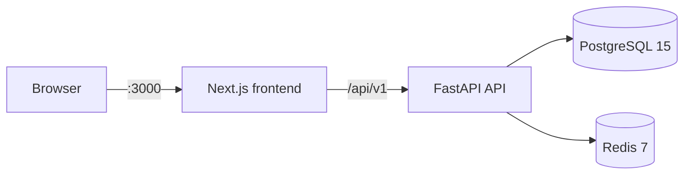

# Local Deployment & Testing Guide

This guide walks through running the **full MCQ platform stack on your machine** for end-to-end testing. It consolidates setup steps from the root [README](../README.md), [backend README](../backend/README.md), and [frontend README](../frontend/README.md) into one ordered workflow.

**Scope:** local development and testing only. Production deployment (TLS, backups, compliance gates) is covered in the [PRD](MCQ_Test_Platform_PRD.md) and planned for Phase 6.

---

## Architecture (local)



| Component | How it runs locally |
|-----------|---------------------|
| **Frontend** | Host process (`pnpm dev` on port 3000) |
| **API** | Docker container ([`infra/docker-compose.yml`](../infra/docker-compose.yml)) |
| **PostgreSQL 15** | Docker container |
| **Redis 7** | Docker container |

Authentication uses **cookie sessions** and **CSRF tokens**. The frontend sends cookies on every API call (`credentials: include` in [`frontend/lib/api/client.ts`](../frontend/lib/api/client.ts)).

---

## Prerequisites

| Tool | Version | Purpose |
|------|---------|---------|
| [Docker Desktop](https://www.docker.com/products/docker-desktop/) | Latest | Postgres, Redis, API containers |
| [Node.js](https://nodejs.org/) | 20+ | Frontend dev server |
| [pnpm](https://pnpm.io/) | Latest | Frontend package manager (used in CI) |
| [Python](https://www.python.org/) | 3.12+ | Migrations, bootstrap, and seed scripts on the host |
| GNU Make | Optional | Convenience targets; raw commands documented below for Windows |

From the repository root for all commands unless noted otherwise.

---

## First-time setup

### Step 1 — Environment files

**macOS / Linux / Git Bash:**

```bash
cp .env.example .env
cp frontend/.env.example frontend/.env.local
```

**PowerShell (Windows):**

```powershell
Copy-Item .env.example .env
Copy-Item frontend\.env.example frontend\.env.local
```

Default values work for local testing:

| File | Key variables |
|------|---------------|
| `.env` (repo root) | `DATABASE_URL`, `REDIS_URL`, `CORS_ORIGINS=http://localhost:3000` |
| `frontend/.env.local` | `NEXT_PUBLIC_API_BASE_URL=http://localhost:8000/api/v1` |

The API container reads `CORS_ORIGINS` from the root `.env`. The frontend must list the same API URL in `.env.local`.

### Step 2 — Start the backend stack

**With Make:**

```bash
make dev-up
```

**Without Make (Windows / any shell):**

```bash
docker compose -f infra/docker-compose.yml up -d --build
```

This starts Postgres, Redis, and the FastAPI container. Wait until all services are healthy:

```bash
docker compose -f infra/docker-compose.yml ps
```

### Step 3 — Apply database migrations

**With Make:**

```bash
make db-migrate
```

**Without Make:**

```bash
cd backend && alembic upgrade head
```

Migration chain:

| Revision | Description |
|----------|-------------|
| `001_initial_app` | App tables, enums, indexes |
| `002_audit_schema` | Append-only `audit.audit_logs` |
| `003_seed_platform_settings` | Default platform settings |
| `004_examiner_is_admin` | `users.is_admin` column |

### Step 4 — Seed data

Seed data is required for meaningful UI and E2E testing (minimum **50** active questions; seed **55** for headroom).

Install backend dependencies on the host (one-time):

```bash
make install-backend
```

**Without Make:**

```bash
cd backend && pip install -e ".[dev]"
```

Create the first examiner account and seed questions:

```bash
python scripts/bootstrap_examiner.py --username admin --password "ChangeMe123456!"
python scripts/seed_questions.py --count 55
```

Password must be at least 12 characters (PRD requirement).

**Admin settings access:** The bootstrap script does not set `is_admin`. To test examiner admin features (settings, user provisioning, GDPR erasure), promote the bootstrap user:

```bash
docker exec mcq-postgres psql -U mcq -d mcq_platform -c "UPDATE users SET is_admin = true WHERE username = 'admin';"
```

### Step 5 — Start the frontend

```bash
cd frontend
pnpm install
pnpm dev
```

Open [http://localhost:3000](http://localhost:3000).

---

## Daily development

After the first-time setup, a typical session looks like this:

```bash
# 1. Start backend (if not already running)
make dev-up
# or: docker compose -f infra/docker-compose.yml up -d

# 2. Start frontend (separate terminal)
cd frontend && pnpm dev
```

Stop the backend when finished:

```bash
make dev-down
# or: docker compose -f infra/docker-compose.yml down
```

View API container logs:

```bash
make dev-logs
# or: docker compose -f infra/docker-compose.yml logs -f api
```

---

## Verification checklist

Use this before a demo or after changing infrastructure.

### API health

| Check | Command | Expected |
|-------|---------|----------|
| Liveness | `curl http://localhost:8000/api/v1/health` | HTTP 200 |
| Readiness | `curl http://localhost:8000/api/v1/ready` | HTTP 200 (Postgres + Redis connected) |
| OpenAPI | `curl http://localhost:8000/api/v1/openapi.json` | JSON OpenAPI document |

**PowerShell alternative** (if `curl` is aliased to `Invoke-WebRequest`):

```powershell
Invoke-RestMethod http://localhost:8000/api/v1/health
Invoke-RestMethod http://localhost:8000/api/v1/ready
```

### Manual smoke tests

| Flow | Steps |
|------|-------|
| **Examiner login** | `/` → "Login as Examiner" → `admin` / `ChangeMe123456!` → redirects to `/examiner/dashboard` |
| **Question bank** | `/examiner/dashboard` — list, create, edit questions |
| **Examinee test** | `/` → enter PRN + name → start test → answer questions → submit → view `/exam/results` |
| **Admin settings** | `/examiner/settings` — requires `is_admin` examiner (see Step 4 above) |

### Automated tests

Run from the repository root unless noted.

| Suite | Command |
|-------|---------|
| Backend tests | `make backend-test` |
| Frontend lint + types | `make frontend-lint` |
| Frontend production build | `make frontend-build` |
| E2E accessibility only | `cd frontend && pnpm test:e2e -- e2e/accessibility.spec.ts` |
| E2E full flows | Backend running + seed data + examiner account (see below) |

**E2E full flows — bash / Git Bash:**

```bash
cd frontend
E2E_WITH_API=1 E2E_EXAMINER_USER=admin E2E_EXAMINER_PASSWORD='ChangeMe123456!' pnpm test:e2e
```

**E2E full flows — PowerShell:**

```powershell
cd frontend
$env:E2E_WITH_API = "1"
$env:E2E_EXAMINER_USER = "admin"
$env:E2E_EXAMINER_PASSWORD = "ChangeMe123456!"
pnpm test:e2e
```

Accessibility tests run without a backend. Examinee and examiner flow tests are skipped unless `E2E_WITH_API=1` is set.

---

## Background jobs (optional)

Background jobs are not scheduled automatically in local dev. Run them manually when testing session expiry, retention, or GDPR erasure:

```bash
cd backend
python scripts/run_jobs.py session-expiry
python scripts/run_jobs.py retention-purge
python scripts/run_jobs.py erasure-processor
python scripts/run_jobs.py all
```

---

## Useful commands

| Action | Make | Without Make |
|--------|------|--------------|
| Start stack | `make dev-up` | `docker compose -f infra/docker-compose.yml up -d --build` |
| Stop stack | `make dev-down` | `docker compose -f infra/docker-compose.yml down` |
| API logs | `make dev-logs` | `docker compose -f infra/docker-compose.yml logs -f` |
| Apply migrations | `make db-migrate` | `cd backend && alembic upgrade head` |
| Roll back one migration | `make db-downgrade` | `cd backend && alembic downgrade -1` |
| Backend tests | `make backend-test` | `cd backend && pytest tests -v` |

### Reset database (destructive)

Removes all local data including seeded questions and examiner accounts:

```bash
make dev-down
docker compose -f infra/docker-compose.yml down -v
make dev-up
make db-migrate
python scripts/bootstrap_examiner.py --username admin --password "ChangeMe123456!"
python scripts/seed_questions.py --count 55
```

Re-run the `is_admin` SQL from Step 4 if you need admin settings access.

---

## Troubleshooting

| Symptom | Likely cause | Fix |
|---------|--------------|-----|
| `/api/v1/ready` returns 503 | Postgres or Redis not healthy | `docker compose -f infra/docker-compose.yml ps` — wait for healthchecks to pass |
| CORS error in browser console | Frontend origin not allowed | Set `CORS_ORIGINS=http://localhost:3000` in root `.env`, restart API: `docker compose -f infra/docker-compose.yml restart api` |
| Frontend calls wrong API | Missing or stale env | Confirm `frontend/.env.local` has `NEXT_PUBLIC_API_BASE_URL=http://localhost:8000/api/v1`; restart `pnpm dev` |
| "Not enough questions" when starting a test | Seed script not run | `python scripts/seed_questions.py --count 55` |
| Examiner login fails | Bootstrap not run or wrong password | Re-run `bootstrap_examiner.py` (min 12-char password) |
| Settings page read-only / save disabled | Examiner lacks `is_admin` | Run the `UPDATE users SET is_admin = true` SQL from Step 4 |
| Port 5432, 6379, or 8000 in use | Conflicting local services | Stop conflicting processes, or copy [`infra/docker-compose.override.example.yml`](../infra/docker-compose.override.example.yml) to `infra/docker-compose.override.yml` and remap ports |
| `make` not found (Windows) | GNU Make not installed | Use the "Without Make" commands in the tables above |
| `pip install` fails on backend | Wrong Python version | Use Python 3.12+: `python --version` |
| Migration errors after git pull | New migrations available | `make db-migrate` |

---

## What this guide does not cover

The following are planned for production / Phase 6 and are **not** required for local testing:

- TLS termination and reverse proxy ([`infra/nginx/README.md`](../infra/nginx/README.md) is a placeholder)
- Production environment flags (`ENVIRONMENT=production`, `SESSION_COOKIE_SECURE=true`)
- Database backups, restore drills, and scheduled cron for background jobs
- GDPR compliance gates before go-live (LIA, DPIA, DPA — PRD §12.1)

For product requirements and acceptance criteria, see [MCQ_Test_Platform_PRD.md](MCQ_Test_Platform_PRD.md).

---

## Related documentation

| Document | Description |
|----------|-------------|
| [README.md](../README.md) | Monorepo overview and quick start |
| [backend/README.md](../backend/README.md) | API, migrations, Redis keys, audit notes |
| [frontend/README.md](../frontend/README.md) | Routes, API integration, E2E |
| [MCQ_Platform_Development_Plan.md](MCQ_Platform_Development_Plan.md) | Phase roadmap including production hardening |
