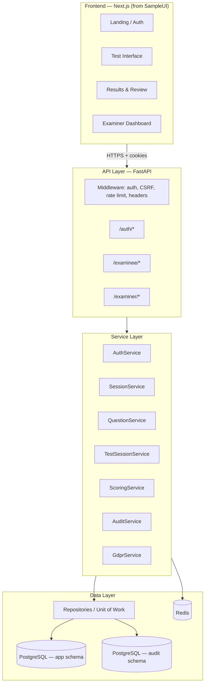
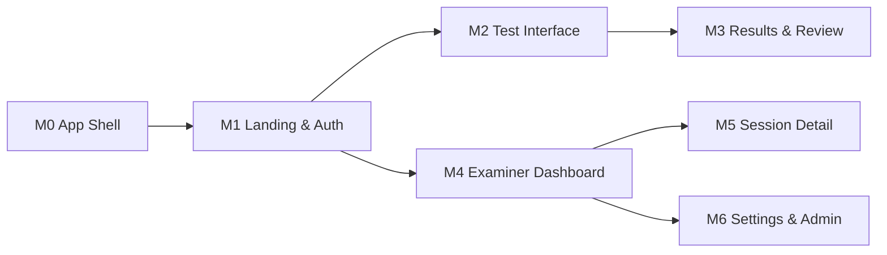
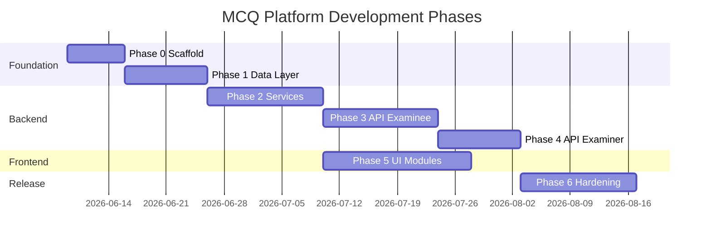

# MCQ Online Test Platform — Software Development Plan

**Document Version:** 1.0  
**Date:** June 3, 2026  
**Status:** Planning — no implementation started  
**Sources:** `MCQ_Test_Platform_PRD.md` v2.1 · `docs/MCQ_Platform_ERD.md` · `SampleUI/`

---

## 1. Purpose and scope

This document defines the **software development roadmap and phased delivery plan** for the MCQ Online Test Platform. It covers:

| Layer | Scope |
|---|---|
| **Project scaffold** | Repository layout, tooling, CI/CD, local dev environment |
| **Data layer** | PostgreSQL schema, Redis stores, migrations, repositories |
| **Service layer** | Orchestration, transactions, cross-cutting concerns |
| **Business logic** | Domain rules (scoring, sessions, auth, GDPR, versioning) |
| **API layer** | FastAPI REST v1, middleware, OpenAPI, error catalogue |
| **UI modules** | Next.js frontend aligned with `SampleUI/` reference screens |

**In scope for this plan:** architecture decisions, module boundaries, phase sequencing, deliverables, and acceptance gates.

**Out of scope (this document):** writing production code, infrastructure provisioning, or compliance document authoring (LIA, DPIA, DPA — required before go-live per PRD §12.1).

---

## 2. Executive summary

The platform is a **role-based MCQ examination system** with two portals:

- **Examinee:** PRN + Name entry → 50-question test → auto-save → submit → score + review
- **Examiner:** Question bank CRUD, results drill-down, CSV export, settings, GDPR erasure

The backend follows a **layered architecture** (API → Service → Repository → PostgreSQL/Redis). The frontend is a **Next.js App Router SPA** derived from the existing `SampleUI/` prototype, wired to the FastAPI backend via cookie-based sessions.

### Recommended delivery timeline (indicative)

| Phase | Focus | Duration (est.) |
|---|---|---|
| **0** | Project scaffold & dev environment | 1 week |
| **1** | Data layer & migrations | 1.5 weeks |
| **2** | Core business logic & service layer | 2 weeks |
| **3** | API layer (auth + examinee flows) | 2 weeks |
| **4** | API layer (examiner + admin + jobs) | 1.5 weeks |
| **5** | UI modules (wire SampleUI to API) | 2.5 weeks |
| **6** | Hardening, testing, compliance gates | 2 weeks |
| **Total** | MVP to production-ready v1.0 | **~12 weeks** |

*Adjust based on team size. A single full-stack developer should treat this as a sequential roadmap; a 2–3 person team can parallelise Phases 3–5 after Phase 2.*

---

## 3. Architecture overview



### Layer responsibilities

| Layer | Responsibility | Must not |
|---|---|---|
| **UI** | Presentation, a11y, client validation (advisory), API calls | Enforce authorization; compute scores; store secrets |
| **API** | HTTP mapping, request/response DTOs, status codes, OpenAPI | Embed business rules; direct SQL |
| **Service** | Use-case orchestration, transactions, audit emission | Know about HTTP details |
| **Business logic** | Pure/domain rules: scoring, session eligibility, versioning | Depend on FastAPI or React |
| **Data** | Persistence, queries, encryption at field level | Contain scoring or auth policy |

---

## 4. Technology decisions

### 4.1 Confirmed stack (aligned with PRD §9.5 + SampleUI)

| Component | Choice | Notes |
|---|---|---|
| **Frontend** | Next.js 16 + React 19 + TypeScript | Adopt `SampleUI/` as the UI foundation (PRD mentions Vite; SampleUI uses Next.js — see §4.2) |
| **UI kit** | shadcn/ui + Radix + Tailwind CSS 4 | Already present in `SampleUI/components/ui/` |
| **Backend** | Python 3.12 + FastAPI | Auto OpenAPI 3.1 |
| **ORM** | SQLAlchemy 2.x + Alembic | Parameterised queries |
| **Database** | PostgreSQL 15+ | App schema + separate audit schema |
| **Cache / sessions** | Redis 7+ | ServerSession, lockout, rate limits, idempotency |
| **Auth** | Opaque server-side sessions (Redis) | HttpOnly, Secure, SameSite=Strict cookies |
| **Testing** | pytest, Testcontainers, Playwright, axe-core, k6 | Per PRD §8.1 |
| **CI/CD** | GitHub Actions | Lint, test, dependency scan, build |

### 4.2 PRD vs SampleUI reconciliation

| Topic | PRD | SampleUI | **Plan decision** |
|---|---|---|---|
| Frontend bundler | Vite + React SPA | Next.js App Router | **Use Next.js** — SampleUI is the approved visual/UX reference; export static or run as Node server behind nginx |
| Session storage | Redis | Mock navigation only | Wire to real API; no localStorage for tokens |
| API integration | Full §9.6 contracts | Comment placeholders | Replace mocks with typed API client |

### 4.3 Repository layout (proposed monorepo)

```
Proj4/
├── frontend/                 # Promoted from SampleUI/
│   ├── app/                  # Next.js routes (see §9)
│   ├── components/
│   ├── lib/                  # api-client, auth, csrf, types
│   └── ...
├── backend/
│   ├── app/
│   │   ├── api/              # FastAPI routers (thin)
│   │   ├── core/             # config, security, dependencies
│   │   ├── domain/           # business rules (pure Python)
│   │   ├── services/         # use-case orchestration
│   │   ├── repositories/     # data access
│   │   ├── models/           # SQLAlchemy ORM
│   │   ├── schemas/          # Pydantic request/response
│   │   └── jobs/             # scheduled tasks (expiry, retention)
│   ├── alembic/
│   ├── tests/
│   └── pyproject.toml
├── infra/
│   ├── docker-compose.yml    # postgres, redis, api, frontend (dev)
│   └── nginx/                # TLS, security headers (staging/prod)
├── docs/
│   ├── MCQ_Platform_ERD.md
│   └── MCQ_Platform_Development_Plan.md  # this file
├── scripts/                  # bootstrap examiner, seed questions
└── .github/workflows/
```

---

## 5. Development roadmap by phase

### Phase 0 — Project scaffold (Week 1)

**Goal:** Runnable local environment with empty backend and promoted frontend skeleton.

| # | Task | Deliverable |
|---|---|---|
| 0.1 | Initialise monorepo structure | `frontend/`, `backend/`, `infra/`, `scripts/` |
| 0.2 | Promote `SampleUI/` → `frontend/` | Working `pnpm dev` with existing mock pages |
| 0.3 | FastAPI project skeleton | `/api/v1/health`, `/api/v1/ready`, `/api/v1/openapi.json` |
| 0.4 | Docker Compose dev stack | PostgreSQL, Redis, API hot-reload |
| 0.5 | Environment configuration | `.env.example` (no secrets in VCS); pydantic-settings |
| 0.6 | CI pipeline (initial) | Lint (ruff, eslint), type-check, placeholder test job |
| 0.7 | Pre-commit hooks | Formatting, secret scan |
| 0.8 | Bootstrap script stub | `scripts/bootstrap_examiner.py` (CLI entry point) |

**Exit criteria:**
- [ ] `docker compose up` starts Postgres + Redis + API
- [ ] Frontend loads all four SampleUI routes
- [ ] CI green on empty test suites

---

### Phase 1 — Data layer (Weeks 2–3)

**Goal:** Complete persistent schema, migrations, and repository interfaces per ERD.

#### 1.1 PostgreSQL — application schema

Implement entities from `docs/MCQ_Platform_ERD.md` §2:

| Entity | Priority | Key constraints |
|---|---|---|
| `User` | P0 | Role-specific unique indexes; encrypted `prn`, `name` |
| `Question` | P0 | Soft delete; `question_version` |
| `QuestionVersion` | P0 | `UNIQUE(question_id, version_number)` |
| `TestSession` | P0 | Status enum; `expires_at`; score nullable |
| `SessionQuestion` | P0 | Exactly 50 per session; frozen version snapshot |
| `Response` | P0 | Pre-created 50 rows; `is_correct` NULL until submit |
| `PlatformSettings` | P0 | Singleton keys (seed defaults) |
| `ErasureJob` | P1 | Async GDPR workflow |

#### 1.2 PostgreSQL — audit schema

Separate schema `audit` with append-only `AuditLog` (ERD §6). No UPDATE/DELETE grants for application role.

#### 1.3 Redis key design

| Key pattern | Purpose | TTL |
|---|---|---|
| `session:{token}` | ServerSession | Role-based (60m / 4h inactivity) |
| `lockout:{username}` | LoginAttemptCounter | 15 min window |
| `ratelimit:register:{ip}` | Registration rate limit | 1 hour |
| `idempotency:submit:{key}` | SubmitIdempotencyRecord | 24 hours |

#### 1.4 Repository layer

| Repository | Methods (initial) |
|---|---|
| `UserRepository` | `find_by_prn`, `find_by_username`, `create_examinee`, `create_examiner`, `anonymise` |
| `QuestionRepository` | CRUD, `count_active`, `list_active_for_selection` |
| `QuestionVersionRepository` | `archive`, `get_by_question_and_version` |
| `TestSessionRepository` | `create_with_questions_and_responses`, `find_active_for_user`, `complete` |
| `ResponseRepository` | `update_selection`, `bulk_set_correctness` |
| `PlatformSettingsRepository` | `get`, `patch` |
| `AuditLogRepository` | `append` (insert-only) |

#### 1.5 Field-level encryption

- Encrypt `User.prn` and `User.name` at rest (application-level AES-256 or pgcrypto)
- Hash PRN for duplicate lookup (HMAC with pepper) without storing reversible duplicate index in plain text

**Exit criteria:**
- [ ] Alembic migrations apply cleanly on empty DB
- [ ] Seed script creates 55 questions + default PlatformSettings
- [ ] Repository integration tests pass against Testcontainers PostgreSQL
- [ ] Redis repository tests pass for session CRUD

---

### Phase 2 — Business logic & service layer (Weeks 4–5)

**Goal:** Domain rules and use-case services with unit tests — **no HTTP yet**.

#### 2.1 Domain modules (`backend/app/domain/`)

| Module | Rules |
|---|---|
| `validation.py` | PRN regex, name trim, password policy, field length limits |
| `session_rules.py` | One ACTIVE session per user; 24h absolute expiry; resume eligibility |
| `question_selection.py` | FIXED_ORDER vs RANDOM_SAMPLE; ≥50 bank check |
| `scoring.py` | Compare `Response.selected_option` to frozen `QuestionVersion.correct_option`; 1 mark each |
| `versioning.py` | Archive on edit; increment version; soft-delete guard (<50 active) |
| `gdpr.py` | Erasure token format; metadata anonymisation rules |
| `concurrency.py` | Optimistic locking via `updated_at` / If-Unmodified-Since |

#### 2.2 Service layer (`backend/app/services/`)

| Service | Responsibilities |
|---|---|
| `AuthService` | Examinee entry/resume/retake; examiner login/logout; session issuance; lockout |
| `CsrfService` | Token generation and validation |
| `TestSessionService` | Create session (50 SessionQuestion + 50 Response); get question by position; auto-save |
| `ScoringService` | Submit transaction: set `is_correct`, compute score, immutable after COMPLETED |
| `QuestionService` | Add/edit/soft-delete with versioning and bank minimum warnings |
| `ResultsService` | Examiner list/detail; examinee review; CSV export |
| `SettingsService` | Read/patch PlatformSettings |
| `UserAdminService` | Create examiner; deactivate; trigger erasure job |
| `AuditService` | Emit structured events (no PII in metadata) |
| `RetentionJobService` | Purge expired ACTIVE sessions; enforce `retention_days_completed` |

#### 2.3 Cross-cutting service concerns

- **Unit of Work:** Single DB transaction for session creation (50+50 rows) and submit scoring
- **Idempotency:** Submit replays return original result from Redis/DB record
- **Activity tracking:** Update `last_activity_at` and Redis session TTL on authenticated calls

**Exit criteria:**
- [ ] Unit tests: scoring with version snapshots (edit question mid-session does not affect active session)
- [ ] Unit tests: examinee entry decision table (PRD §3.1.5)
- [ ] Unit tests: soft-delete blocked when active count would fall below 50
- [ ] Service integration tests with mocked repositories

---

### Phase 3 — API layer: auth & examinee (Weeks 6–7)

**Goal:** Implement §9.6.2–9.6.4 endpoints with middleware and RFC 7807 errors.

#### 3.1 Middleware stack (order matters)

1. Request ID (`X-Request-Id`)
2. Security headers (PRD §4.5)
3. CORS (configured frontend origin, `credentials: true`)
4. Session authentication (cookie → Redis → `user_id`, `role`)
5. CSRF validation (state-changing routes)
6. Rate limiting (login, registration)
7. Role guard (examiner vs examinee path prefixes)

#### 3.2 Auth routes

| Method | Path | Maps to |
|---|---|---|
| `GET` | `/auth/csrf` | CsrfService |
| `POST` | `/auth/examinee/entry` | AuthService.examinee_entry |
| `POST` | `/auth/examiner/login` | AuthService.examiner_login |
| `POST` | `/auth/logout` | AuthService.logout |
| `GET` | `/auth/me` | AuthService.get_current_user |

#### 3.3 Examinee routes

| Method | Path | Critical behaviour |
|---|---|---|
| `GET` | `/examinee/sessions/current` | Session summary |
| `GET` | `/examinee/sessions/{id}/questions/{position}` | **Exclude** `correct_option`, `is_correct` |
| `PUT` | `/examinee/sessions/{id}/responses/{questionId}` | Auto-save; optimistic concurrency |
| `POST` | `/examinee/sessions/{id}/submit` | Idempotent; server-side score |
| `GET` | `/examinee/sessions/{id}/review` | COMPLETED only; includes correct answers |
| `GET` | `/examinee/me/data-export` | GDPR Article 15/20 JSON download |

#### 3.4 Error catalogue

Implement all problem types from PRD §9.7 as Pydantic models; generic production messages; `request_id` on every error.

**Exit criteria:**
- [ ] Contract tests for auth + full examinee happy path
- [ ] IDOR tests: examinee cannot access another session (404 default)
- [ ] Active session API never leaks `correct_option` or `is_correct`
- [ ] OpenAPI spec matches implemented routes

---

### Phase 4 — API layer: examiner & operations (Weeks 8–9)

**Goal:** Examiner portal API, background jobs, health/readiness.

#### 4.1 Examiner routes

| Group | Endpoints |
|---|---|
| Questions | `GET/POST /examiner/questions`, `PATCH/DELETE /examiner/questions/{id}` |
| Results | `GET /examiner/sessions`, `GET /examiner/sessions/{id}`, `GET /examiner/sessions/export` |
| Users | `POST /examiner/users/examiners`, `POST /examiner/users/examinees/{id}/erase` |
| Settings | `GET/PATCH /examiner/settings` |

#### 4.2 Background jobs

| Job | Schedule | Action |
|---|---|---|
| Session expiry | Every 5 min | ACTIVE → EXPIRED/COMPLETED after 24h absolute; audit log |
| Retention purge | Daily | Delete/anonymise completed sessions past `retention_days_completed` |
| Abandoned session cleanup | Daily | Purge interim state per §5.4 |

#### 4.3 Bootstrap & seed

- `scripts/bootstrap_examiner.py` — first examiner with forced password change
- `scripts/seed_questions.py` — 55 MCQ items for staging

**Exit criteria:**
- [ ] Examiner CRUD with audit log entries verified in tests
- [ ] CSV export UTF-8 BOM; audit logged
- [ ] Erasure returns 202; PII replaced with `ERASED-{uuid}`
- [ ] DELETE question returns 409 when bank would drop below 50

---

### Phase 5 — UI modules (Weeks 10–12)

**Goal:** Replace SampleUI mocks with production API integration; meet WCAG 2.1 AA.

#### 5.1 Frontend infrastructure

| Module | Path | Purpose |
|---|---|---|
| API client | `frontend/lib/api/` | Typed fetch wrapper; credentials; CSRF header injection |
| Auth context | `frontend/lib/auth/` | Session state from `/auth/me`; role-aware redirects |
| Types | `frontend/lib/types/` | Generated from OpenAPI (openapi-typescript) |
| Error handling | `frontend/lib/errors/` | Parse RFC 7807; map to accessible toasts/alerts |

#### 5.2 UI module map (SampleUI → production)

| SampleUI route | Production module | API dependencies | PRD refs |
|---|---|---|---|
| `app/page.tsx` | **M1: Landing & Auth** | `GET /auth/csrf`, `POST /auth/examinee/entry`, `POST /auth/examiner/login` | §3.1, §6 |
| `app/exam/test/page.tsx` | **M2: Test Interface** | Session current, get question, put response, submit | §3.2, §3.6 |
| `app/exam/results/page.tsx` | **M3: Results & Review** | Submit response (redirect), `GET .../review` | §3.3, §3.4.2 |
| `app/examiner/dashboard/page.tsx` | **M4: Examiner Dashboard** | Questions CRUD, sessions list, export | §3.4.3, §3.5 |
| *(new)* | **M5: Session Detail** | `GET /examiner/sessions/{id}` | §3.4.3 |
| *(new)* | **M6: Settings & Admin** | Settings, create examiner, erasure | §3.1.6, §5.5 |
| `app/layout.tsx` | **M0: App Shell** | Skip link, focus styles, dynamic `<title>`, `lang="en"` | §6 |

#### 5.3 UI development sequence



| Order | Module | Key tasks |
|---|---|---|
| 1 | **M0 App Shell** | Skip-to-main link; shared header/footer; route guards; page titles |
| 2 | **M1 Landing & Auth** | Wire forms to API; privacy notice; aria-live errors; 409/403 handling |
| 3 | **M2 Test Interface** | Remove mock questions; auto-save with retry (NFR-14); If-Unmodified-Since; End Test modal a11y |
| 4 | **M3 Results & Review** | Score from submit API; review tab from `/review`; assertive score announcement |
| 5 | **M4 Examiner Dashboard** | Paginated question bank; add/edit/delete dialogs; results table with cursor pagination |
| 6 | **M5 Session Detail** | Per-question drill-down for examiner; audit-triggering view |
| 7 | **M6 Settings & Admin** | Retention/retake/selection mode; examiner provisioning; erasure confirm flow |

#### 5.4 SampleUI gaps to close (PRD compliance)

| Gap in SampleUI | Required change |
|---|---|
| No skip navigation link | Add as first focusable element (WCAG 2.4.1) |
| No CSRF / cookie auth | API client with `credentials: 'include'` |
| Mock data throughout | Replace with API + loading/error states |
| No auto-save retry UI | Banner with retry on 503 (NFR-14) |
| Examiner: no settings/erasure/provisioning | New M6 module |
| Examiner: View details button inert | M5 session detail page |
| Dynamic page titles missing on test nav | Update `document.title` per question |
| `aria-live` for save confirmation | Add polite status region |

**Exit criteria:**
- [ ] E2E: full examinee flow (entry → 50 Q → submit → review)
- [ ] E2E: examiner add/edit/delete question + view results
- [ ] axe-core: zero critical/serious violations on all routes
- [ ] Manual NVDA pass on M2 and M3

---

### Phase 6 — Hardening & release readiness (Weeks 13–14)

| Area | Tasks |
|---|---|
| **Security** | OWASP ZAP baseline in CI; dependency scan gates; penetration test scheduling |
| **Performance** | k6 load test — 100 concurrent ACTIVE sessions (NFR-02) |
| **Operations** | Backup/restore drill; runbooks for §7.3 alerts |
| **Documentation** | README, deployment guide, API changelog |
| **Compliance gates** | LIA, DPIA, DPA evidence checklist (PRD §12.1) |

**Exit criteria:** All PRD §13 acceptance criteria traceable to passing tests.

---

## 6. Module specification summary

### 6.1 Data layer modules

| Module | Files (proposed) | Depends on |
|---|---|---|
| ORM models | `backend/app/models/*.py` | SQLAlchemy |
| Migrations | `backend/alembic/versions/` | Models |
| Repositories | `backend/app/repositories/*.py` | Models, Redis client |
| Encryption | `backend/app/core/encryption.py` | Config/secrets |
| Unit of Work | `backend/app/repositories/uow.py` | All repos |

### 6.2 Service layer modules

| Service | Consumes | Produces |
|---|---|---|
| `AuthService` | UserRepo, SessionStore, LockoutStore, AuditService | Session cookie, user context |
| `TestSessionService` | TestSessionRepo, QuestionRepo, SettingsRepo | SessionQuestion + Response rows |
| `ScoringService` | ResponseRepo, QuestionVersionRepo | Completed session + score |
| `QuestionService` | QuestionRepo, QuestionVersionRepo, AuditService | Versioned CRUD |
| `GdprService` | UserRepo, ErasureJobRepo, AuditService | Anonymised records |

### 6.3 API layer modules

| Router prefix | Tag | Role guard |
|---|---|---|
| `/api/v1/health` | ops | public |
| `/api/v1/auth` | auth | mixed |
| `/api/v1/examinee` | examinee | EXAMINEE |
| `/api/v1/examiner` | examiner | EXAMINER |

### 6.4 UI modules

| ID | Name | Routes | Shared components |
|---|---|---|---|
| M0 | App Shell | layout, error boundaries | Skip link, Toaster, ThemeProvider |
| M1 | Landing & Auth | `/` | Role cards, privacy notice, login forms |
| M2 | Test Interface | `/exam/test` | Question navigator, radio group, End Test dialog |
| M3 | Results & Review | `/exam/results` | Score hero, review accordion |
| M4 | Examiner Dashboard | `/examiner/dashboard` | Question table, results table, tabs |
| M5 | Session Detail | `/examiner/sessions/[id]` | Response breakdown table |
| M6 | Settings & Admin | `/examiner/settings` | Settings form, user admin |

---

## 7. Testing strategy (by phase)

| Phase | Test type | Focus |
|---|---|---|
| 1 | Integration | Migrations, repositories, encryption round-trip |
| 2 | Unit | Domain rules, scoring, entry decision table |
| 3–4 | Contract / API | Schemathesis or pytest against OpenAPI; IDOR, role violations |
| 5 | E2E + a11y | Playwright flows; axe-core on each route |
| 6 | Load + security | k6 (NFR-02); OWASP ZAP baseline |

### Critical test scenarios (must pass before v1.0)

1. Examinee entry → resume ACTIVE session with saved answers intact
2. Examinee entry → 409 when COMPLETED and retake disabled
3. Submit idempotency — duplicate `Idempotency-Key` returns same 201
4. Question edited after session start — score uses frozen version
5. Examiner lockout after 5 failed logins
6. Examinee API during ACTIVE session — no `correct_option` in any response
7. GDPR erasure — PRN/Name replaced; stats retained
8. Concurrent tab auto-save — stale If-Unmodified-Since returns 409; client retries

---

## 8. Dependencies and sequencing



**Parallelisation notes:**
- Phase 5 **M0, M1** can start once Phase 3 auth endpoints exist (week 6)
- Phase 5 **M2, M3** require Phase 3 examinee API complete
- Phase 5 **M4–M6** require Phase 4 examiner API complete
- UI component work (styling, a11y fixes in SampleUI) can proceed during Phase 2 without API

---

## 9. Acceptance traceability matrix (sample)

| PRD §13 criterion | Phase | Verification |
|---|---|---|
| Auto-save on selection | 3, 5 | API contract test + E2E |
| No correct/incorrect during test | 3, 5 | API assertion + UI inspection |
| 50 SessionQuestion per session | 1, 2 | Integration test |
| Score immutable after COMPLETED | 2 | Unit test + DB constraint |
| WCAG modal focus trap | 5 | Playwright + manual SR |
| OpenAPI matches §9.6 | 3, 4 | Contract test diff |
| 100 concurrent sessions | 6 | k6 report |

*Full matrix to be expanded into a test plan spreadsheet during Phase 0.*

---

## 10. Risks and mitigations

| Risk | Impact | Mitigation |
|---|---|---|
| PRD Vite vs SampleUI Next.js | Architecture drift | Adopt Next.js; update PRD stack note in release docs |
| Field encryption complexity | Schedule slip | Start with app-level AES; document key rotation |
| WCAG regressions in shadcn components | Compliance failure | axe in CI; manual SR testing each sprint |
| Question bank &lt; 50 in dev | Blocked examinee flows | Seed script mandatory in Compose |
| GDPR erasure async complexity | Data leaks | Integration test cascade; code review gate |

---

## 11. Open decisions — questions for stakeholders

The following items require confirmation before Phase 0 implementation begins:

| # | Question | Options | Default if no answer |
|---|---|---|---|
| Q1 | **Repository strategy:** monorepo (proposed) or separate frontend/backend repos? | Monorepo / Multi-repo | Monorepo |
| Q2 | **Frontend framework:** adopt SampleUI Next.js or rewrite to Vite SPA per PRD §9.5? | Next.js / Vite | Next.js (SampleUI) |
| Q3 | **Deployment target:** cloud provider and region (GDPR NFR-17)? | AWS EU / Azure EU / On-prem | Docker Compose for dev; decide before Phase 6 |
| Q4 | **PII encryption approach:** application-level AES vs PostgreSQL pgcrypto vs infra FDE only? | App / pgcrypto / FDE | App-level AES for prn/name columns |
| Q5 | **Team size and target go-live date?** | N developers, date | 12-week single-developer estimate |
| Q6 | **Random question mode in v1.0?** | Ship FIXED_ORDER only first / Both | Both (settings already in ERD) |
| Q7 | **Examiner settings UI in v1.0?** | Full M6 / Minimal (retake toggle only) | Full M6 per PRD |
| Q8 | **Promote SampleUI in-place or keep `SampleUI/` and create new `frontend/`?** | Rename/move / Copy | Move to `frontend/`, archive SampleUI |

---

## 12. Next steps (when development starts)

When approved, Phase 0 begins with:

1. Confirm answers to §11 open decisions
2. Create monorepo folder structure
3. Move `SampleUI/` → `frontend/`
4. Scaffold FastAPI backend with health endpoints
5. Add `docker-compose.yml` for PostgreSQL + Redis
6. Open initial Alembic migration from ERD

**No code will be written until this plan is reviewed and Phase 0 is explicitly kicked off.**

---

## 13. Document references

| Document | Path |
|---|---|
| Product Requirements | `MCQ_Test_Platform_PRD.md` v2.1 |
| Entity Relationship Diagram | `docs/MCQ_Platform_ERD.md` |
| UI Reference Implementation | `SampleUI/` |
| Development Plan (this file) | `docs/MCQ_Platform_Development_Plan.md` |

---

*— End of Development Plan v1.0 —*
