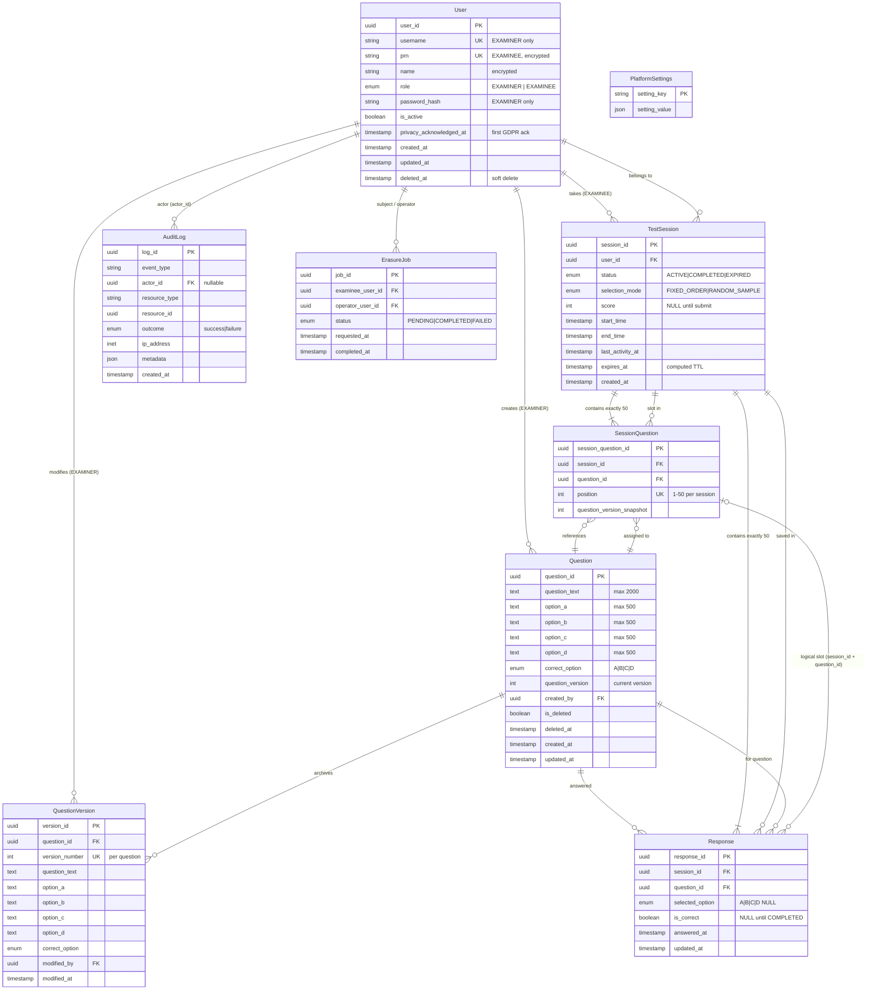
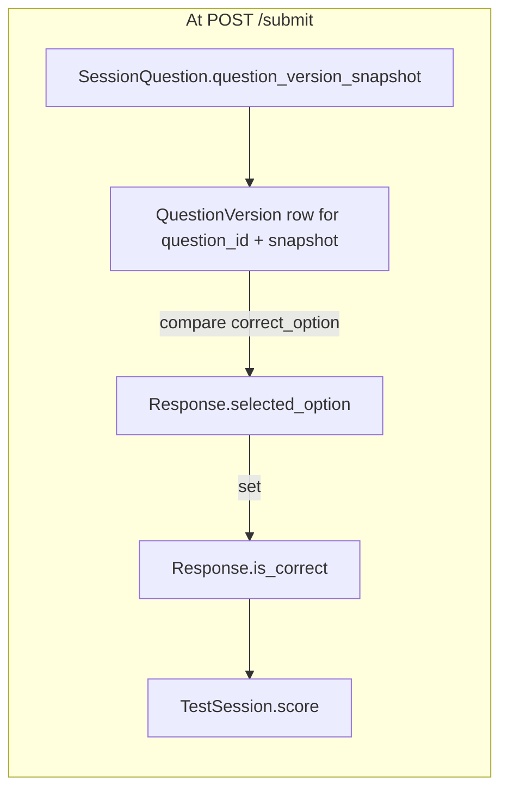
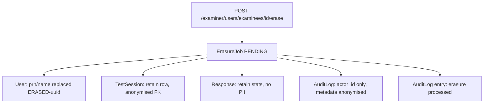
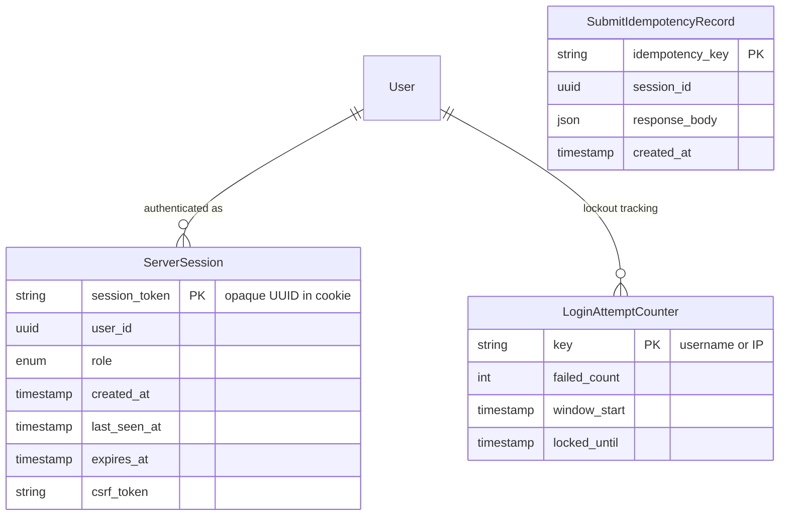
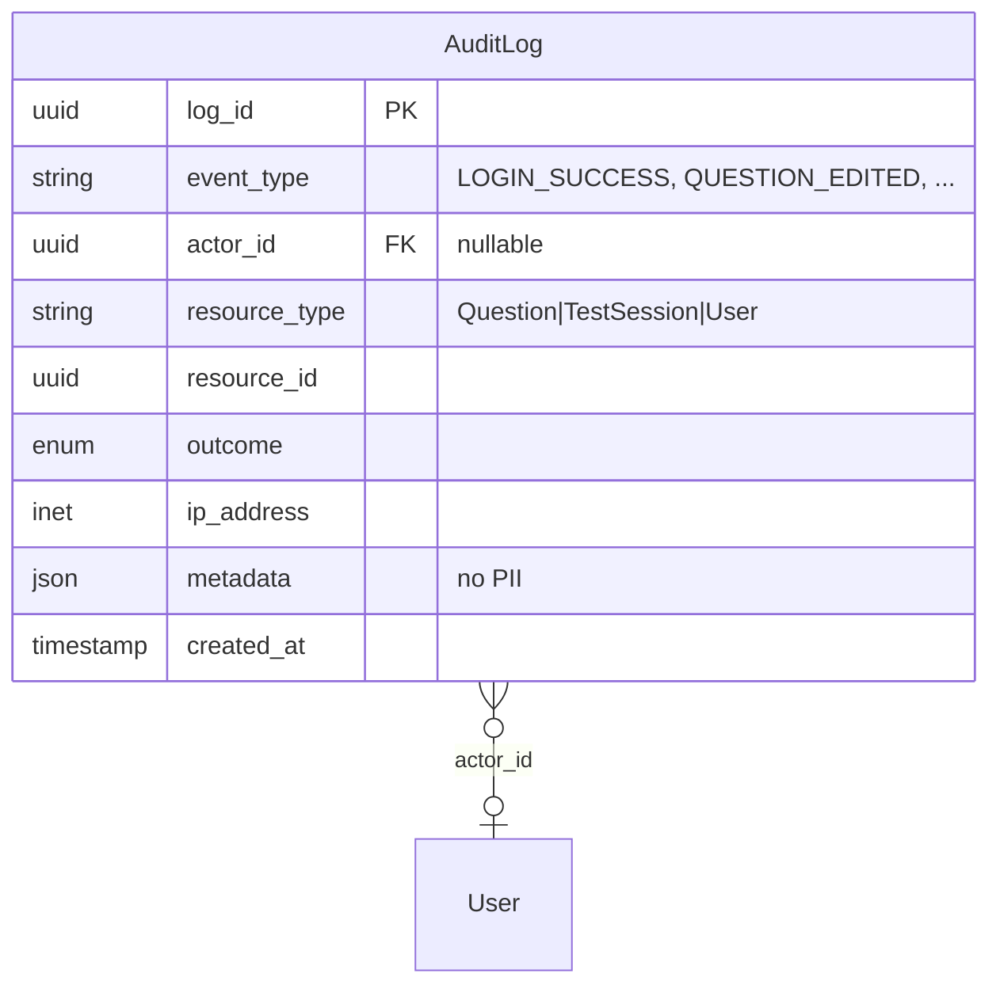
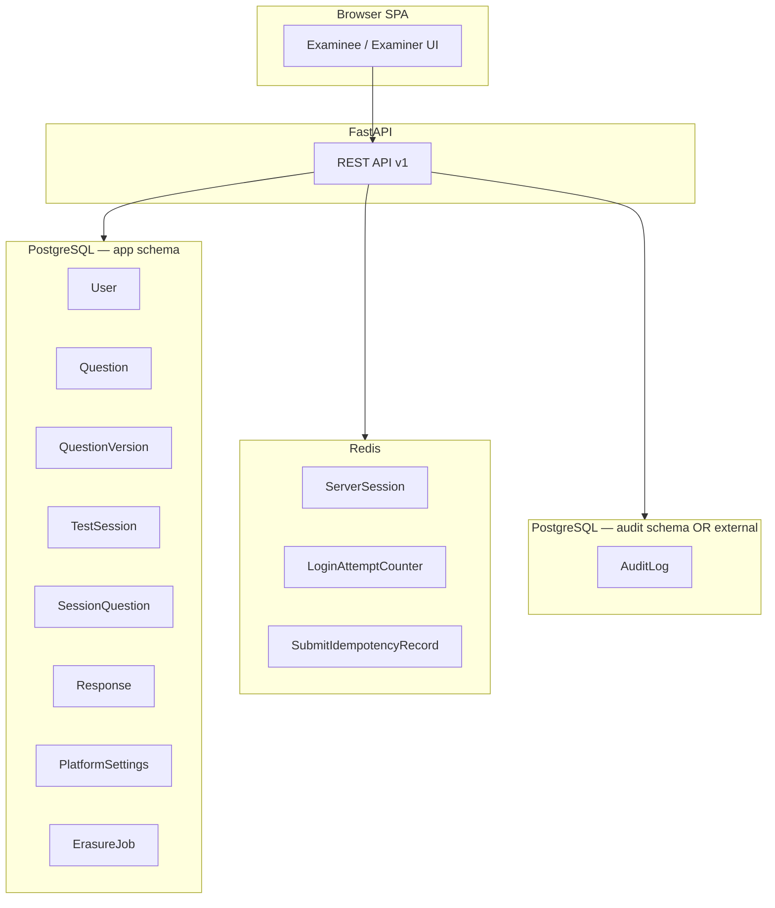

# MCQ Online Test Platform — Entity Relationship Diagram

**Source:** `MCQ_Test_Platform_PRD.md` v2.1  
**Date:** June 3, 2026

This document models **all persistent application entities**, **cross-cutting infrastructure stores**, and how they map to PRD functional areas.

---

## 1. Functional coverage map

| PRD area | Entities / stores involved |
|---|---|
| §3.1 Examinee entry, resume, retake | `User`, `TestSession`, `PlatformSettings`, `ServerSession` (Redis) |
| §3.1 Examiner login, lockout | `User`, `ServerSession`, `LoginAttemptCounter` (Redis) |
| §3.2–3.3 Test UI, auto-save, scoring | `TestSession`, `SessionQuestion`, `Response` |
| §3.4 Response storage & review | `Response`, `SessionQuestion`, `QuestionVersion` (historical text) |
| §3.5 Question bank CRUD | `Question`, `QuestionVersion`, `User` (examiner) |
| §3.6 Exam session rules | `TestSession`, `SessionQuestion`, `PlatformSettings` |
| §5 GDPR erasure & retention | `User`, `TestSession`, `Response`, `ErasureJob`, `PlatformSettings` |
| §7 Audit & monitoring | `AuditLog` (separate schema / store) |
| §9.6 API / idempotent submit | `TestSession`, `SubmitIdempotencyRecord` (optional) |

---

## 2. Core application database (PostgreSQL)

### 2.1 Entity Relationship Diagram (Mermaid)



### 2.2 Cardinality and business rules

| Relationship | Cardinality | Rule (PRD) |
|---|---|---|
| `User` → `TestSession` | 1 : N | Default: one **COMPLETED** attempt per PRN; N &gt; 1 only if `allow_examinee_retake` |
| `User` → `TestSession` (ACTIVE) | 1 : 0..1 | At most **one ACTIVE** session per Examinee `user_id` |
| `TestSession` → `SessionQuestion` | 1 : 50 | Created atomically at session start |
| `TestSession` → `Response` | 1 : 50 | Pre-created; `selected_option` updated on auto-save |
| `Question` → `QuestionVersion` | 1 : N | New row on each edit; live row in `Question` |
| `SessionQuestion` → `Question` | N : 1 | Version frozen via `question_version_snapshot` |
| `Response` → `Question` | N : 1 | Unique (`session_id`, `question_id`) |
| `AuditLog` → `User` | N : 0..1 | `actor_id` null for unauthenticated failures |

### 2.3 Unique constraints and indexes (implementation)

```
User:           UNIQUE(username) WHERE role=EXAMINER
                UNIQUE(prn) WHERE role=EXAMINEE AND deleted_at IS NULL

Question:       INDEX(is_deleted, question_id)  -- bank count / FIXED_ORDER

QuestionVersion: UNIQUE(question_id, version_number)

TestSession:    INDEX(user_id, status)
                INDEX(status, last_activity_at)  -- expiry job

SessionQuestion: UNIQUE(session_id, position)
                 UNIQUE(session_id, question_id)

Response:        UNIQUE(session_id, question_id)

PlatformSettings: PK on setting_key (singleton keys)
```

### 2.4 `PlatformSettings` keys (singleton configuration)

| `setting_key` | Type | Purpose |
|---|---|---|
| `retention_days_completed` | int | GDPR automated purge (default 730) |
| `allow_examinee_retake` | bool | §3.1.5 retake policy |
| `question_selection_mode` | enum | `FIXED_ORDER` \| `RANDOM_SAMPLE` |

---

## 3. Scoring and historical integrity (logical view)

Scoring at submit reads **frozen** content, not the live `Question` row:



- **`Response.is_correct`:** `NULL` while `TestSession.status = ACTIVE` (§3.6.4).
- **`TestSession.score`:** immutable after `COMPLETED` (§4.8).

---

## 4. GDPR erasure cascade



Personal data lives primarily on **`User`** (PRN, name). `TestSession` and `Response` reference `user_id` only (§3.4.1).

---

## 5. Infrastructure stores (non-relational, required by PRD)

These are **not** normalized into PostgreSQL but are required for §3.1, §4.7, and §9.5.



| Store | Technology | PRD reference |
|---|---|---|
| `ServerSession` | Redis | §3.1.4, §9.5 — HttpOnly cookie → server validation |
| `LoginAttemptCounter` | Redis | §3.1.3, §4.4 — 5 failures / 15 min |
| `SubmitIdempotencyRecord` | Redis or PostgreSQL | §9.4 — idempotent End Test |
| Registration rate limit | Redis | §4.4 — 10 / IP / hour |

---

## 6. Audit log (separate schema or external store)

Per §7.2, audit data is **append-only** and stored separately from application tables.



**Polymorphic reference:** `resource_type` + `resource_id` → `Question`, `TestSession`, or `User` (no FK enforcement across types; enforced in application layer).

### 6.1 Audit events → entities

| Event (§7.1) | `resource_type` | `resource_id` |
|---|---|---|
| Examiner login / logout / lockout | `User` | examiner `user_id` |
| Question add/edit/delete | `Question` | `question_id` |
| Session opened / closed | `TestSession` | `session_id` |
| Examiner views results | `TestSession` | `session_id` |
| Erasure processed | `User` | examinee `user_id` |
| Role violation (403) | — | endpoint in `metadata` |

---

## 7. Complete system context diagram



---

## 8. Entity-to-API mapping (summary)

| Entity | Primary API surface |
|---|---|
| `User` | `/auth/examinee/entry`, `/auth/examiner/login`, `/auth/me`, `/examiner/users/*` |
| `TestSession` | `/examinee/sessions/*`, `/examiner/sessions/*` |
| `SessionQuestion` + `Response` | `GET .../questions/{position}`, `PUT .../responses/{questionId}` |
| `Question` | `/examiner/questions` |
| `PlatformSettings` | `/examiner/settings` |
| `AuditLog` | Written internally; not exposed via Examinee API |
| `ServerSession` | Cookie auth on all authenticated routes |

---

## 9. Recommended additions (implied by PRD, not explicit in §9.2)

| Field / entity | Rationale |
|---|---|
| `User.privacy_acknowledged_at` | GDPR Article 13 proof of acknowledgement (§3.1.1) |
| `ErasureJob` | Async `202` erasure workflow (§9.6.8) |
| `SubmitIdempotencyRecord` | Idempotent submit (§9.4) |
| `TestSession.expires_at` | §3.6.2 session TTL enforcement |

---

*Generated from MCQ_Test_Platform_PRD.md v2.1*
